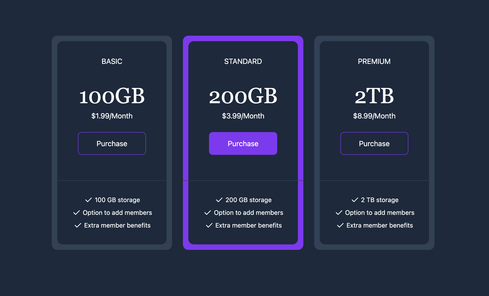

# Tailwind Mini-Projects

This repository contains various mini-projects built with HTML and Tailwind CSS. Each project demonstrates a specific UI component or feature, styled with Tailwind’s utility-first framework.

1. [Email Subscribe](#email-subscribe)
2. [Pricing Cards](#pricing-cards)

## Email Subscribe

The component includes an image, a brief text description, an input field for the user’s email address, and a “Subscribe” button.

### Preview

## Pricing Cards

The component includes three pricing cards, each representing a different package, starting from the cheapest to the most expensive. Each card contains details about the respective package, including the price, features, and a call-to-action button.

### Preview

## Course Information

This project is part of the "Tailwind CSS From Scratch | Learn By Building Projects"
course on Udemy, created by Brad Traversy.
