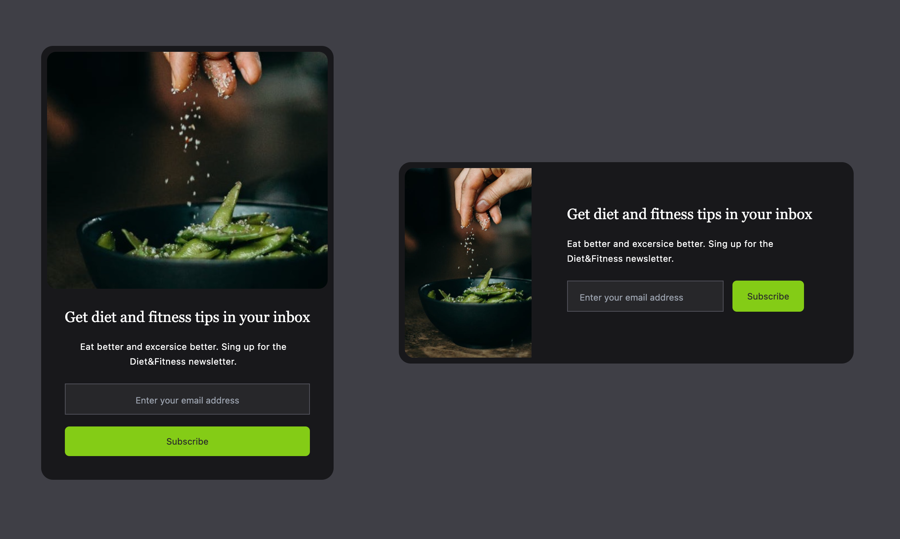

# Tailwind Mini-Projects

## Email Subscribe Component

This mini project demonstrates a responsive Email Subscribe component built using HTML and Tailwind CSS. The component includes an image, a brief text description, an input field for the user’s email address, and a “Subscribe” button.

### Preview

## Course Information

This project is part of the "Tailwind CSS From Scratch | Learn By Building Projects"
course on Udemy, created by Brad Traversy.
